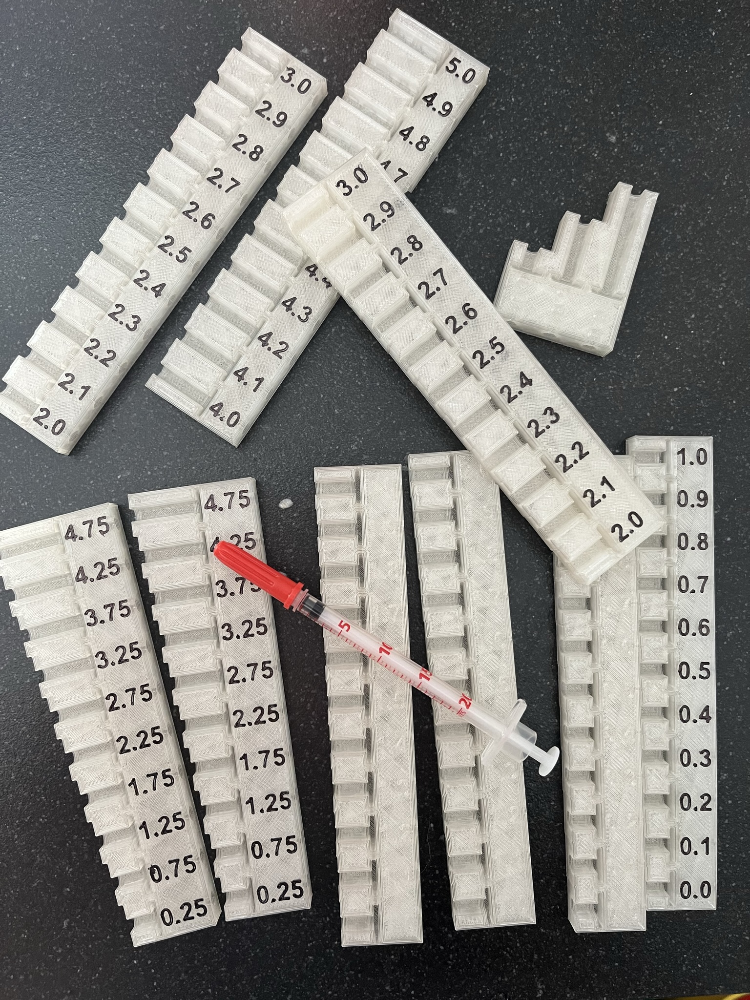
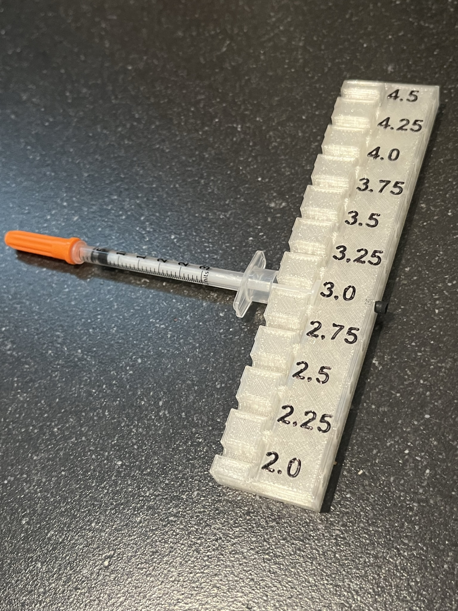
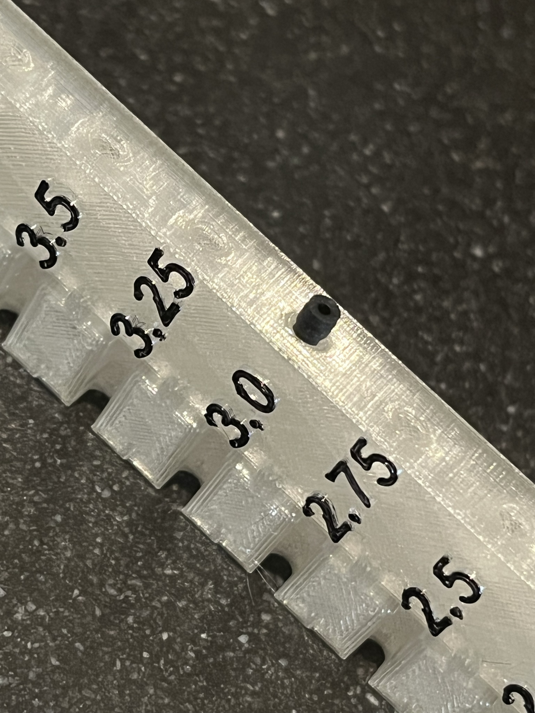
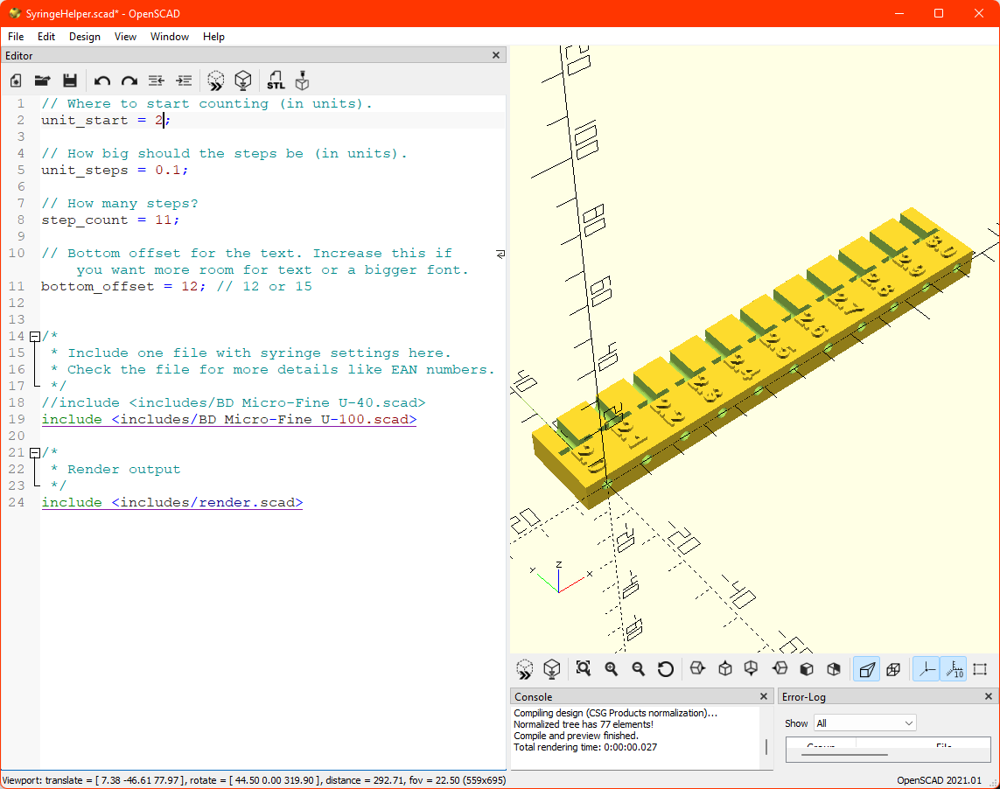

# SyringeHelper
A 3D printable tool for repeatable precise dosing of insulin.

Also published on:
- https://www.printables.com/model/253310-syringe-dosage-helper
- https://www.thingiverse.com/thing:5448298

## What is it
This is a tool that you fit around the syringe plunger head to get a precise dosage of insulin.

## Currently supported syringes
- BD Micro-Fine+ 0,5ml U40 8mm - EAN: [0382904876036](https://duckduckgo.com/?q=0382904876036)
- BD Micro-Fine+ Demi 0,3ml U100 8mm 30G - EAN: [0382904826031](https://duckduckgo.com/?q=0382904876036)

Note that the U-100 version currently centers on the top part of the plunger. This is a design choice made by https://www.diabetes-katzen.net in their excellent [paper version](https://www.diabetes-katzen.net/images/insulinspritzenmass/Insulinspritzenmass_mit_Erkl%c3%a4rung.pdf). Because we were initially using that, we kept the 0,5 unit offset.

## How to use
- First fill your syringe with a larger amount of insulin.
- Make sure all the bubbles are out.
- Fit the tool around the plunger head.
- Push the tool against the syringe body.
- Validate your result. If your result is different, check if the printed index has an offset. You can see this at the 0 point.

Extra: The model has holes on the side where you can fit the rubber head of the plunger. Use this to mark your current dosage.

## Create your own
You can download these files and open the SyringeHelper.scad file in OpenScad (you need the includes folder too). [OpenScad](https://openscad.org/) is free software that allows you to make a 3D model by programming. It might be a bit daunting to start with, but if you use a supported syringe, it boils down to changing 3 or 4 variables.

## How did you calibrate?
We started by just measuring the index size of a full syringe. So for a syringe for 30 units of insulin, we would measure the distance between 0 and 30 units in millimeters and use that to calculate a ratio. After that we did some test prints with 3 steps of 10 units to fine-tune this ratio. We went a bit overboard and bought a precision balance ([Kern pcb 250-3](https://www.kern-sohn.com/cgi-bin/cosmoshop/lshop.cgi?action=suche&ls=en&gesamt_zeilen=0&fresh=1&suchbegriff=PCB%20250-3)) to measure our results. This scale can repeatably measure down to 1 microgram, so we filled our syringes with water and we were able to ensure our results were correct and repeatable. We discovered the plastic part of the syringe is dependable enough to use as a measurement support. Luckily only the printed index is imprecise.

## Disclaimer
Please test your print before using. This was all calibrated for my 3D Printer (Creality Ender 3 V2). Do not assume my measurements are correct for your syringes. Test them on at least 10 syringes and decide for yourself if you feel comfortable using them.

## Background
We have a cat that needs insulin. A cat is a lot smaller than a human and needs more precise dosing. The pens we found would only be configurable for half a unit of insulin, while an animal as small as a cat could need changes down to 0.1 units. We also found that most manual syringes have a reasonably dependable plastic mold, but imprecise printing. The printed index on the syringe could differ up to 0.2 units. Long story short, it is impossible to measure a repeatable, precise dose without some sort of tool.. So we made a tool.

PS: If you have a diabetic cat and you speak Dutch, feel free to join the forum [Diabeteskatten.nl](https://www.diabeteskatten.nl) for expert advice and support.
